# UNIC-Adapter: Unified Image-Instruction Adapter for Multimodal Image Generation
[](https://arxiv.org/abs/2412.18928)
[](https://opensource.org/licenses/MIT)
[](https://huggingface.co/AIDC-AI/UNIC-Adapter)
UNIC-Adapter is a unified image-instruction adapter that integrates multimodal instructions for controllable image generation. This repository contains the official implementation for the CVPR 2025 paper "UNIC-Adapter: Unified Image-instruction Adapter with Multi-modal Transformer for Image Generation".

In this repository, we release a model based on SD3 Medium, which supports the tasks described in our paper. In addition, we also provide two additional models: one built on SD3.5 Medium, which is capable of traditional computer vision perception tasks, and another on FLUX.1-dev, which supports both instruction-based image editing and traditional computer vision perception tasks.

## Quick Start

### Installation
```bash
git clone https://github.com/AIDC-AI/UNIC-Adapter.git
cd UNIC-Adapter
pip install -r requirements.txt
```

### Download Pretrained Models
Download the trained adapter models from [Hugging Face](https://huggingface.co/AIDC-AI/UNIC-Adapter/) and place them in `./ckpts/`:
- `sd3_medium_adapter.pth`
- `sd3.5_medium_adapter.pth`
- `flux_adapter.pth`

### Inference
Run batch inference using the provided scripts. Outputs will be saved in `./examples/`:
```bash
# For Stable Diffusion 3 Medium
sh test_sd3_medium.sh

# For Stable Diffusion 3.5 Medium
sh test_sd3_5_medium.sh

# For FLUX.1-dev
sh test_flux.sh
```

**Important**: Before running the scripts, update the base_model_path in the bash files:

#### Configuration Files
Inference uses JSON configuration files specifying input parameters. Example configs in `./examples/` include:
- `pixel_level_example.json`: Pixel-level control tasks
- `style_example.json`: Style transfer tasks
- `subject_example_wo_bg.json`: Subject-driven generation (white background)
- `subject_example_w_bg.json`: Subject-driven generation
- `editing_example.json`: Image editing tasks
- `understand_example.json`: Image understanding tasks

Example configuration structure:
```json
{
  "instruction_image": "./examples/input_imgs/pixel_control_imgs/hed_0.png",
  "instruction_prompt": "Generate image from hed edge",
  "save_path": "./examples/output_imgs/pixel_control_imgs/hed_0.png",
  "prompt": "Modern living space description...",
  "output_h": 512,
  "output_w": 512,
  "prompt_guidance": 3.0,
  "image_instruction_guidance": 1.3,
  "task_type": "pixel",
  "seed": 1204
}
```

### Gradio Demo
Launch interactive demos for different models:

```bash
# For Stable Diffusion 3 Medium
python app_sd3_medium.py

# For Stable Diffusion 3.5 Medium
python app_sd3.5_medium.py

# For FLUX.1-dev
python app_flux.py
```
**Important**: Before running the demo, update the model paths in the Python files:
```python
# Replace with your local paths
pipe = StableDiffusion3Pipeline.from_pretrained(
    "/Path/to/your/local/stable-diffusion-3.5-medium/", 
    torch_dtype=torch.float16
)
```

## Generated samples

### Pixel-level Control
*(Left: Condition image, Center left: SD3 Medium with UNIC-Adapter, Center right: SD3.5 Medium with UNIC-Adapter, Right: FLUX.1-dev with UNIC-Adapter)*

<div float="left">
  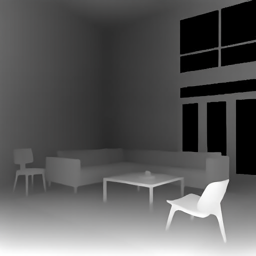
  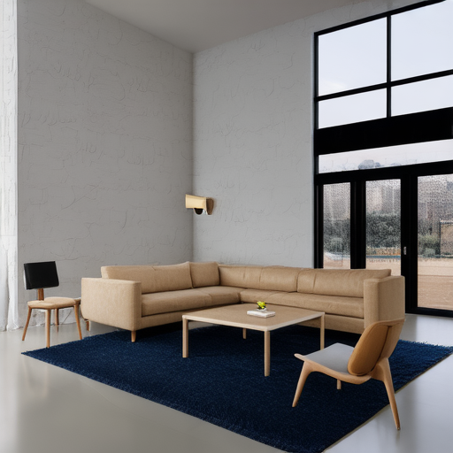
  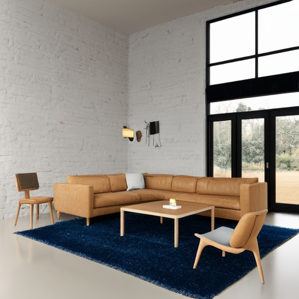
  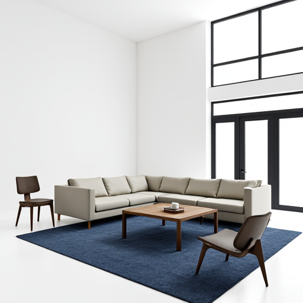
</div>


### Subject-driven Generation
*(Left: Condition image, Center left: SD3 Medium with UNIC-Adapter, Center right: SD3.5 Medium with UNIC-Adapter, Right: FLUX.1-dev with UNIC-Adapter)*

<div float="left">
  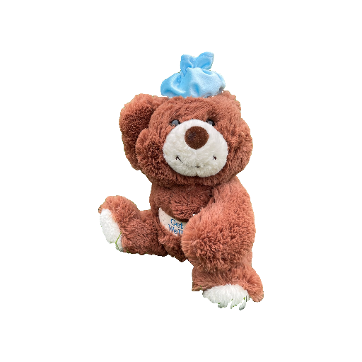
  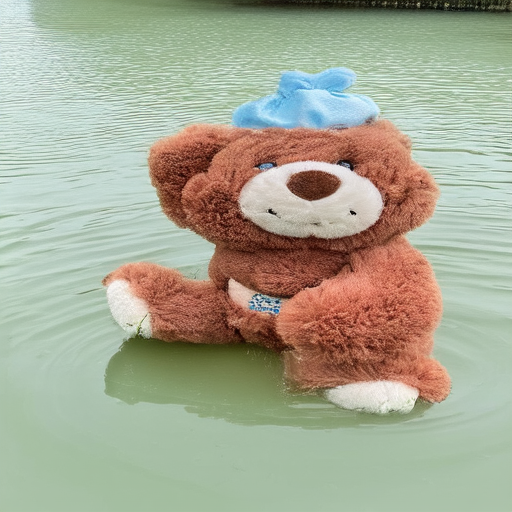
  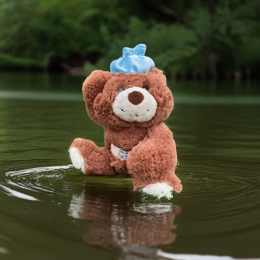
  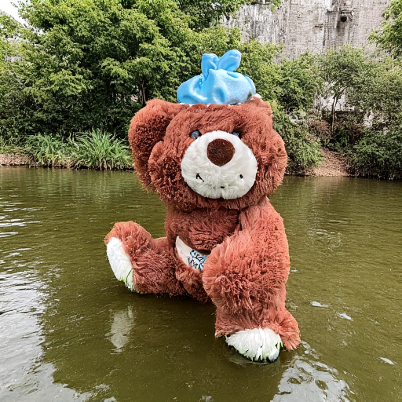
</div>

<div float="left">
  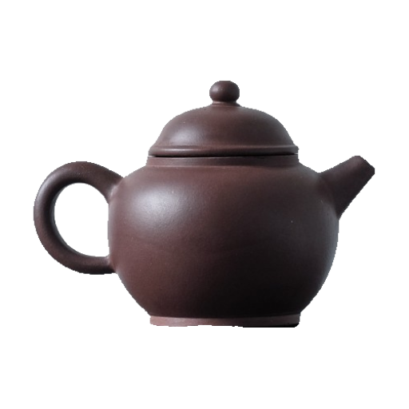
  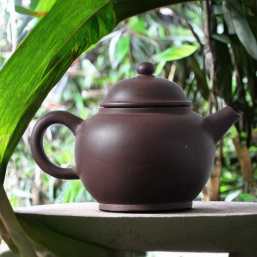
  
  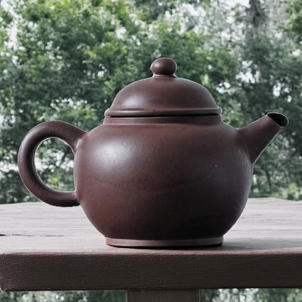
</div>

*(Left: condition image, Center: SD 3.5 medium with UNIC-Adapter, Right: FLUX.1-dev with UNIC-Adapter)*
<div float="left">
  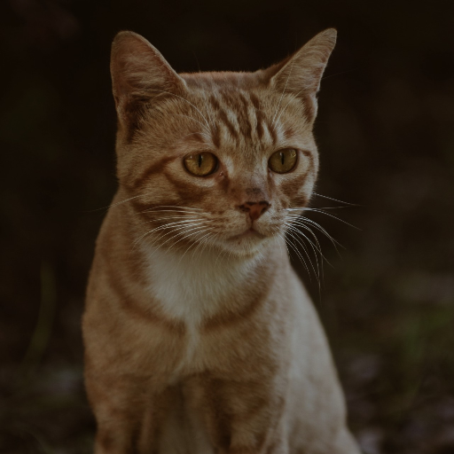
  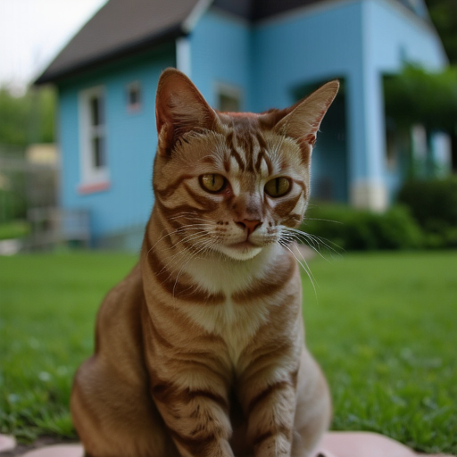
  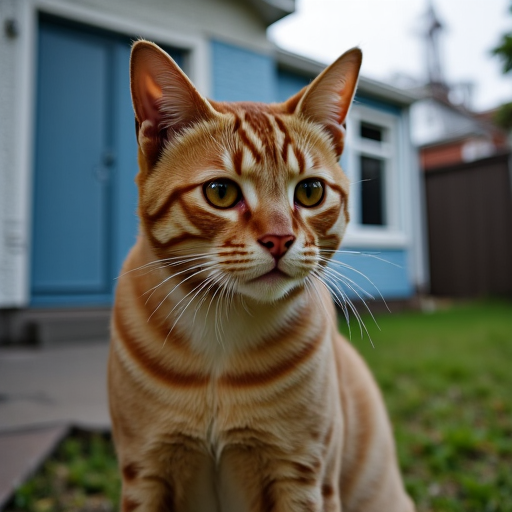
</div>

<div float="left">
  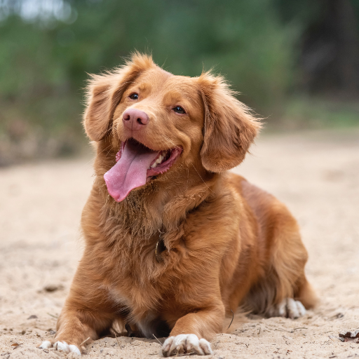
  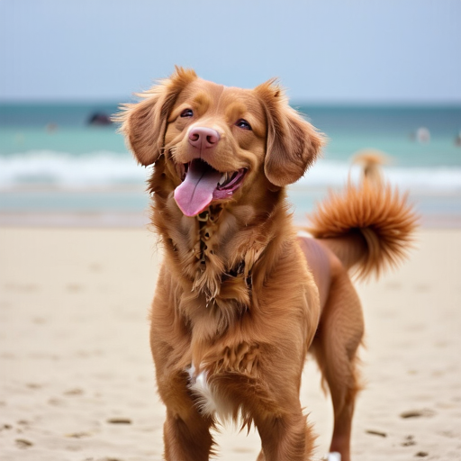
  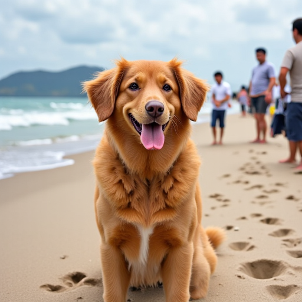
</div>

### Style-driven Generation
*(Left: Condition image, Center left: SD3 Medium with UNIC-Adapter, Center right: SD3.5 Medium with UNIC-Adapter, Right: FLUX.1-dev with UNIC-Adapter)*

<div float="left">
  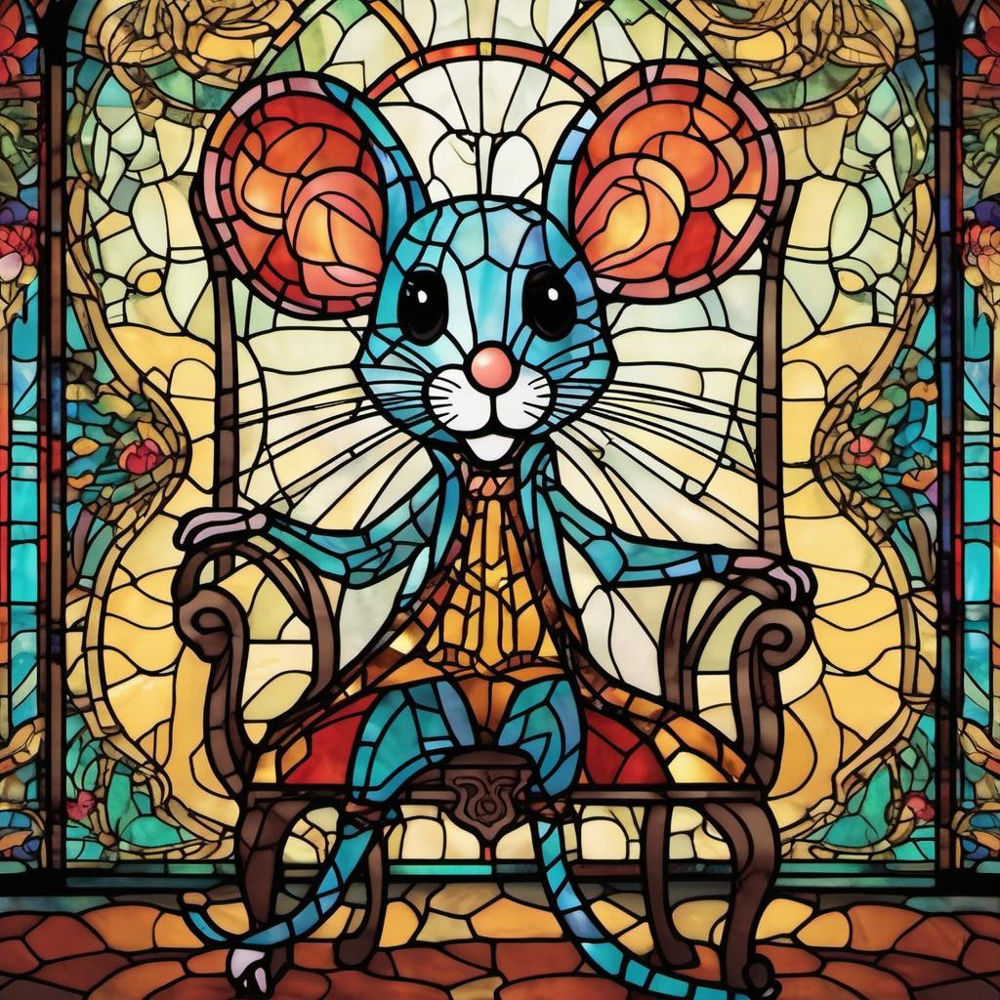
  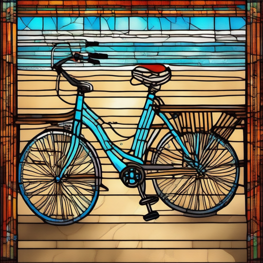
  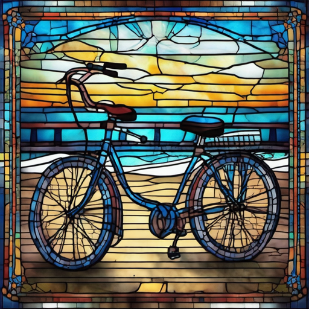
  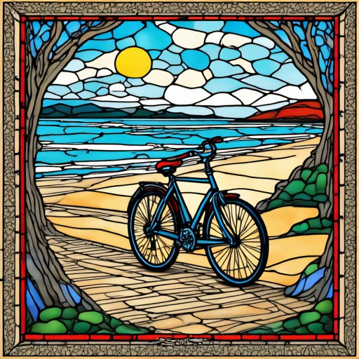
</div>

<div float="left">
  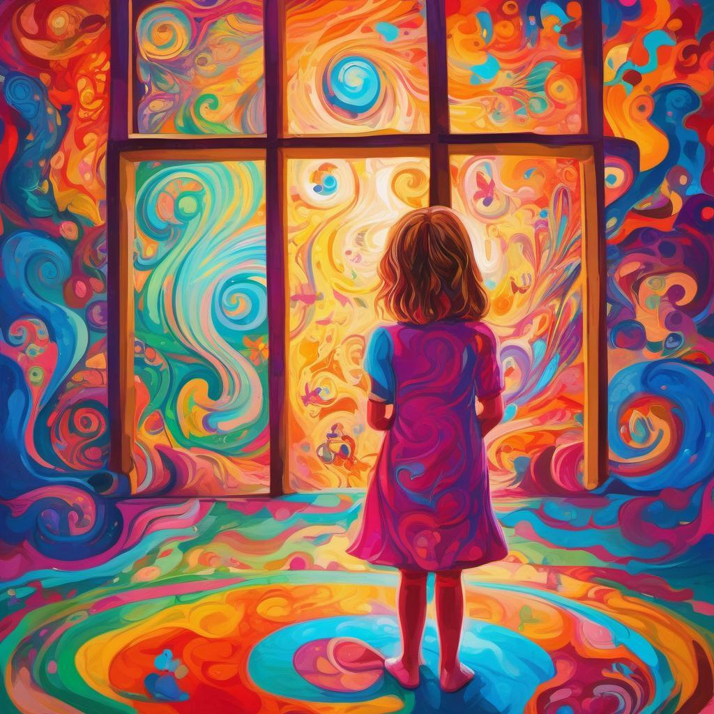
  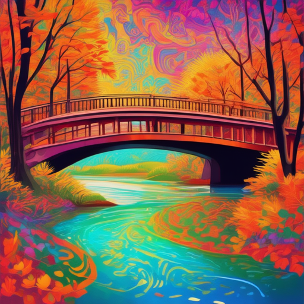
  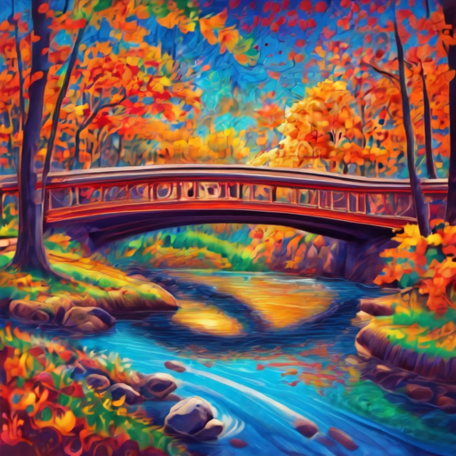
  
</div>

### Image Understanding 
*(Left: Source image, Center: SD3.5 Medium with UNIC-Adapter, Right: FLUX.1-dev with UNIC-Adapter)*

<div float="left">
  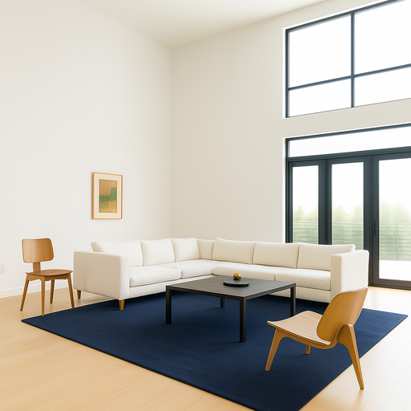
  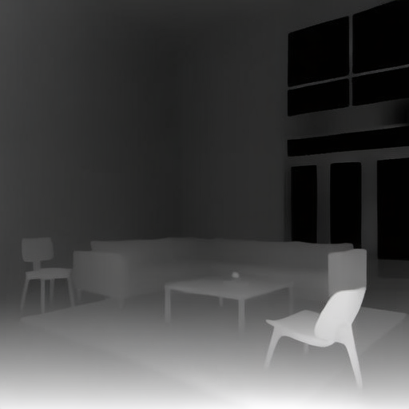
  
</div>


### Image Editing
*(Left: Source image, Right: FLUX.1-dev with UNIC-Adapter)*

<div float="left">
  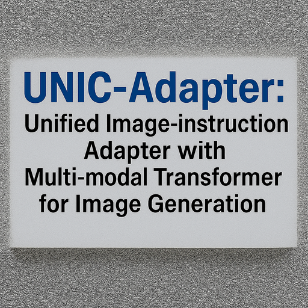
  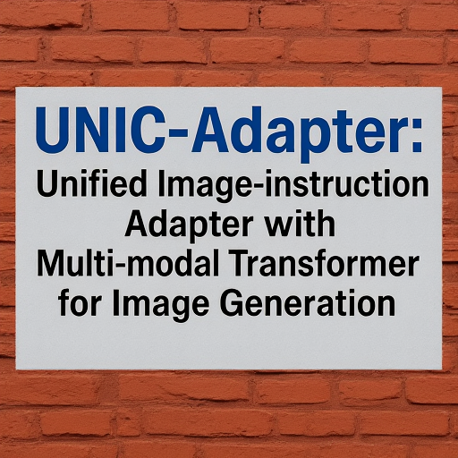
</div>
<div float="left">
  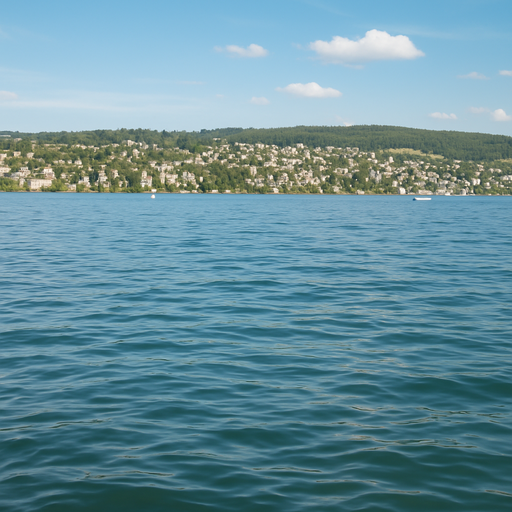
  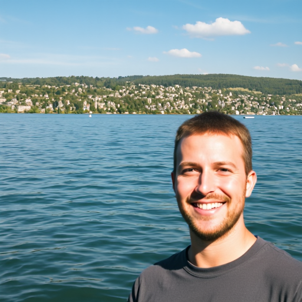
</div>


## License
The project is released under the MIT License (https://opensource.org/licenses/MIT, SPDX-License-identifier: MIT).

## Citation
If you find this repo is helpful for your research, please cite our paper:
```bibtex
@inproceedings{duan2025unic,
  title={UNIC-Adapter: Unified Image-instruction Adapter with Multi-modal Transformer for Image Generation},
  author={Duan, Lunhao and Zhao, Shanshan and Yan, Wenjun and Li, Yinglun and Chen, Qing-Guo and Xu, Zhao and Luo, Weihua and Zhang, Kaifu and Gong, Mingming and Xia, Gui-Song},
  booktitle={Proceedings of the Computer Vision and Pattern Recognition Conference},
  pages={7963--7973},
  year={2025}
}
```

